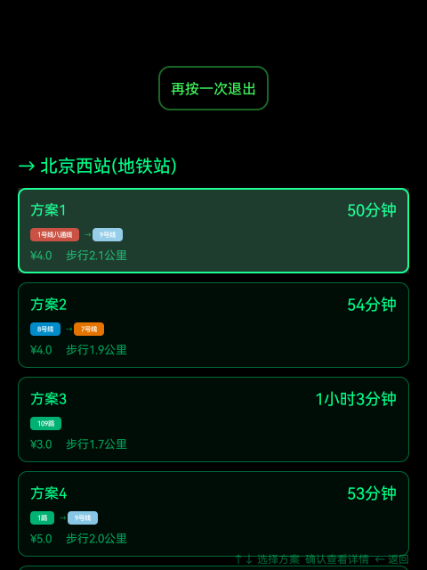
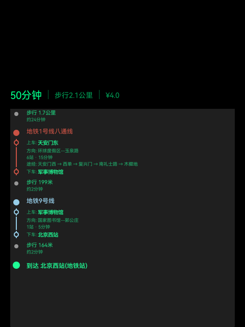

# Rokid AR Glasses — Subway Navigation (地铁导航)

Voice-controlled subway navigation app for **Rokid AR smart glasses**. Speak your origin and destination in Chinese, and the app finds the best transit routes using Amap (Gaode) API with on-device speech recognition.

<p align="center">
  
  
</p>

## Features

- **Offline Speech Recognition** — Sherpa-onnx Zipformer model runs entirely on-device, no cloud ASR needed
- **Natural Language Input** — Understands "从天安门到中关村", "去西单", "北京站到上海站" etc.
- **Cross-City Transit** — Automatically detects cities from place names, supports inter-city searches
- **Multiple Route Plans** — Displays alternatives with duration, cost, and transfer count
- **Detailed Step-by-Step** — Line colors, boarding/alighting stations, via stations, walking distances
- **AR Glasses Optimized** — 480×640 portrait HUD, touchpad gestures, no keyboard needed

## Tech Stack

| Component | Technology |
|-----------|-----------|
| Language | Kotlin |
| ASR Engine | [Sherpa-onnx](https://github.com/k2-fsa/sherpa-onnx) Zipformer (14M params, int8, 24MB) |
| Map API | [Amap Web Services](https://lbs.amap.com/) (Geocoding + Transit Route Planning) |
| Audio | Android AudioRecord (MIC source, 16kHz mono) |
| Network | OkHttp 4.12 |
| JSON | Gson 2.10 |
| Async | Kotlin Coroutines |
| Target Device | Rokid AR glasses (Android 10+, arm64-v8a) |

## Architecture

```
┌─────────────────────────────────────────┐
│              Rokid AR Glasses           │
│  ┌────────────┐  ┌──────────────────┐   │
│  │ AudioRecord│→ │ Sherpa-onnx ASR  │   │
│  │ (MIC 16kHz)│  │ (Zipformer int8) │   │
│  └────────────┘  └───────┬──────────┘   │
│                          │ text         │
│                  ┌───────▼──────────┐   │
│                  │ NLP Parser       │   │
│                  │ (Regex: 从A到B)  │   │
│                  └───────┬──────────┘   │
│                          │ origin, dest │
│                  ┌───────▼──────────┐   │
│                  │ Amap Web API     │   │   ← WiFi / Phone Hotspot
│                  │ Geocode + Transit│   │
│                  └───────┬──────────┘   │
│                          │ routes       │
│                  ┌───────▼──────────┐   │
│                  │ HUD Display      │   │
│                  │ (Green theme)    │   │
│                  └──────────────────┘   │
└─────────────────────────────────────────┘
```

## Project Structure

```
transit_app/
├── app/
│   ├── libs/
│   │   └── sherpa-onnx-1.12.29.aar          # ASR engine (download separately)
│   ├── src/main/
│   │   ├── assets/sherpa/                    # Model files (download separately)
│   │   │   ├── encoder-epoch-99-avg-1.int8.onnx
│   │   │   ├── decoder-epoch-99-avg-1.int8.onnx
│   │   │   ├── joiner-epoch-99-avg-1.int8.onnx
│   │   │   └── tokens.txt
│   │   ├── java/com/rokid/transit/
│   │   │   ├── ui/
│   │   │   │   ├── TransitMainActivity.kt    # Voice input + route query
│   │   │   │   ├── TransitResultActivity.kt  # Route plan list
│   │   │   │   ├── TransitDetailActivity.kt  # Route detail view
│   │   │   │   └── TransitDataHolder.kt      # Cross-activity data
│   │   │   ├── service/
│   │   │   │   ├── VoiceRecognizer.kt        # Sherpa-onnx wrapper
│   │   │   │   └── AmapTransitService.kt     # Amap API client
│   │   │   ├── data/
│   │   │   │   └── TransitModels.kt          # Data classes
│   │   │   └── util/
│   │   │       └── FormatUtil.kt             # Duration/distance formatting
│   │   └── res/
│   │       ├── layout/                       # 3 activity layouts
│   │       ├── values/                       # Colors, strings, styles
│   │       ├── drawable/                     # Custom shapes
│   │       └── xml/                          # Network security config
│   └── build.gradle
├── subway.sh                                  # ADB launch script
├── build.gradle
└── settings.gradle
```

## Setup

### Prerequisites

- Android Studio (AGP 8.2+)
- Rokid AR glasses connected via ADB
- Amap Web API key ([apply here](https://lbs.amap.com/))

### Step 1: Download Model Files

The speech recognition model files are too large for Git. Download them:

```bash
# Sherpa-onnx AAR
wget https://github.com/k2-fsa/sherpa-onnx/releases/download/v1.12.29/sherpa-onnx-1.12.29.aar
mv sherpa-onnx-1.12.29.aar transit_app/app/libs/

# Chinese Zipformer model (int8 quantized)
wget https://github.com/k2-fsa/sherpa-onnx/releases/download/asr-models/sherpa-onnx-streaming-zipformer-zh-14M-2023-02-23.tar.bz2
tar xf sherpa-onnx-streaming-zipformer-zh-14M-2023-02-23.tar.bz2

# Copy model files to assets
mkdir -p transit_app/app/src/main/assets/sherpa/
cp sherpa-onnx-streaming-zipformer-zh-14M-2023-02-23/encoder-epoch-99-avg-1.int8.onnx transit_app/app/src/main/assets/sherpa/
cp sherpa-onnx-streaming-zipformer-zh-14M-2023-02-23/decoder-epoch-99-avg-1.int8.onnx transit_app/app/src/main/assets/sherpa/
cp sherpa-onnx-streaming-zipformer-zh-14M-2023-02-23/joiner-epoch-99-avg-1.int8.onnx transit_app/app/src/main/assets/sherpa/
cp sherpa-onnx-streaming-zipformer-zh-14M-2023-02-23/tokens.txt transit_app/app/src/main/assets/sherpa/
```

### Step 2: Configure API Key

Edit `AmapTransitService.kt` and replace the API key:

```kotlin
private const val API_KEY = "YOUR_AMAP_WEB_API_KEY"
```

### Step 3: Build & Deploy

```bash
cd transit_app
./gradlew assembleDebug

# Install to Rokid glasses
adb install -r app/build/outputs/apk/debug/app-debug.apk
```

### Step 4: Connect Network

The glasses need WiFi for Amap API calls:

```bash
adb shell svc wifi enable
adb shell 'cmd wifi connect-network "YourWiFiName" wpa2 "YourPassword"'
```

### Step 5: Launch

```bash
# Voice input mode (speak origin & destination)
adb shell am start -n com.rokid.transit/.ui.TransitMainActivity

# Direct query mode
adb shell am start -n com.rokid.transit/.ui.TransitMainActivity \
  --es origin_name "天安门" --es destination "中关村"
```

Or use the convenience script:

```bash
./subway.sh 北京西站
```

## Usage (On Glasses)

| Action | Gesture |
|--------|---------|
| Start listening | Swipe forward (DPAD_RIGHT) |
| Next plan / scroll down | Swipe forward |
| Prev plan / scroll up / back | Swipe backward (DPAD_LEFT) |
| Select plan | Swipe forward at last plan / press center |
| Exit | Double swipe backward |

## Key Implementation Notes

### Rokid Audio HAL Workaround

Rokid's custom Audio HAL rejects `AudioSource.VOICE_RECOGNITION(6)`. This app uses `AudioSource.MIC(1)` which is supported by Rokid's AGM/PAL stack:

```kotlin
AudioRecord(MediaRecorder.AudioSource.MIC, 16000,
    AudioFormat.CHANNEL_IN_MONO, AudioFormat.ENCODING_PCM_16BIT, bufSize)
```

### Cross-City Route Planning

When user says "从武汉站到光谷广场", the app:
1. Geocodes "武汉站" → gets coordinates + city "武汉市"
2. Geocodes "光谷广场" → gets coordinates + city "武汉市"
3. Calls Amap transit API with both cities for cross-city support

### ASR Model Selection

Evaluated multiple options:

| Engine | WER (AISHELL) | Model Size | Decision |
|--------|---------------|------------|----------|
| Vosk (small-cn) | ~7.9% | 42MB | ❌ Poor accuracy on station names |
| **Sherpa-onnx Zipformer** | **~1.74%** | **24MB (int8)** | ✅ Used |
| Rokid internal ASR | N/A | System only | ❌ Not accessible to 3rd-party apps |

## .gitignore

The following files are excluded from the repo (too large):

```
# Model files (download separately, see Setup)
app/src/main/assets/sherpa/*.onnx
app/libs/*.aar

# Build outputs
build/
app/build/
.gradle/
*.apk
local.properties
```

## License

MIT

## Author

Shanghao Dai
