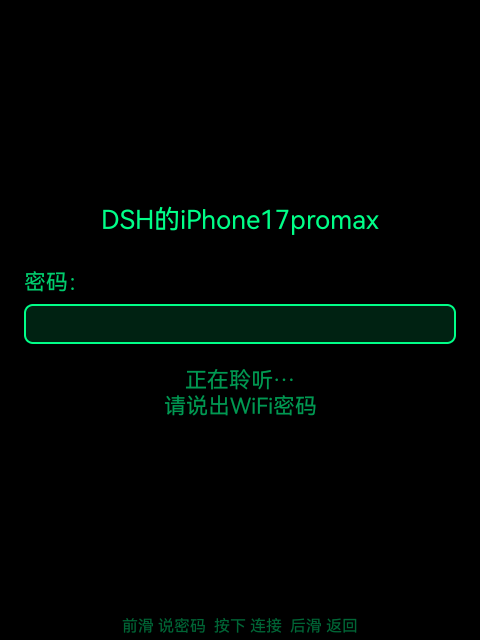
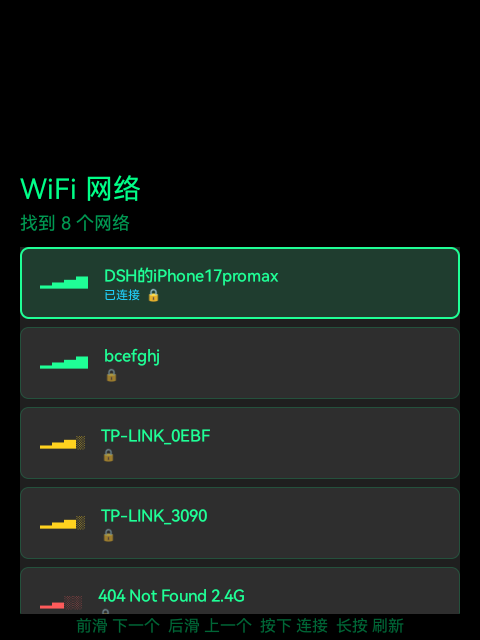

# Rokid AR Glasses — WiFi Connect App

> 专为无触摸屏 AR 眼镜设计的 WiFi 连接工具，支持手势滑动导航 + 离线语音输入密码。

**Author**: Shanghao Dai

---

## 项目简介

这是一款运行在 **Rokid AR 眼镜**（Android 12，无触摸屏）上的 WiFi 连接应用。  
由于眼镜没有触摸屏，所有操作通过**手势识别映射为方向键（DPAD）事件**驱动 UI。

### 核心特性

- **无触摸屏适配**：完全基于 DPAD 方向键操控，兼容 Leanback 设备
- **WiFi 自动唤醒**：检测到 WiFi 关闭时自动开启并等待硬件就绪
- **离线语音输入**：集成 [sherpa-onnx](https://github.com/k2-fsa/sherpa-onnx) Zipformer 模型，无需网络即可语音输入密码
- **双 API 兼容**：支持 Android 10+ `WifiNetworkSpecifier` 及旧版 `WifiConfiguration`

---

## 效果截图

| WiFi 列表页 | 密码输入页 |
|:-----------:|:---------:|
|  |  |

---

## 操作说明

### WiFi 列表页
| 手势 | 动作 |
|------|------|
| 前滑（向右）| 选择下一个网络 |
| 后滑（向左）| 选择上一个网络 / 退出 |
| 按下 | 连接选中网络 |
| 长按 | 刷新扫描 |

### 密码输入页
| 手势 | 动作 |
|------|------|
| 前滑 / 后滑 | 在键盘按键间移动（循环） |
| 按下 | 输入当前选中按键 |
| 选中 🎤 并按下 | 语音输入密码 |
| 选中 ⌫ 并按下 | 删除最后一个字符 |
| 选中 连接 并按下 | 连接 WiFi |

---

## 技术栈

| 分类 | 技术 |
|------|------|
| 语言 | Kotlin |
| 最低 SDK | Android 10（API 29） |
| 目标 SDK | Android 14（API 34） |
| UI | ViewBinding + ConstraintLayout |
| 异步 | Kotlin Coroutines + lifecycleScope |
| WiFi | WifiManager / WifiNetworkSpecifier / ConnectivityManager |
| 语音识别 | sherpa-onnx 1.12.29（Zipformer int8 量化模型） |
| 架构 | arm64-v8a |

---

## 项目结构

```
app/src/main/
├── java/com/rokid/wificonnect/
│   ├── service/
│   │   ├── WifiHelper.kt         # WiFi 扫描、连接、状态管理
│   │   └── VoiceRecognizer.kt    # 离线语音识别封装
│   └── ui/
│       ├── WifiListActivity.kt   # WiFi 列表页（主界面）
│       └── WifiPasswordActivity.kt # 密码输入页
├── assets/sherpa/                # 语音识别模型（ONNX）
└── res/
    ├── layout/                   # XML 布局文件
    └── drawable/ values/         # 样式资源
```

---

## 直接安装 APK

无需编译，直接下载安装：

👉 [下载 ZIP（releases/rokid-wifi-connect-v1.0.zip）](releases/rokid-wifi-connect-v1.0.zip)

解压后安装：
```bash
unzip rokid-wifi-connect-v1.0.zip
adb install rokid-wifi-connect-v1.0.apk
```

---

## 编译运行

### 环境要求

- Android Studio Hedgehog 或更高
- JDK 17
- Android SDK 34

### 步骤

```bash
git clone https://github.com/bcefghj/Rokid_Wifi.git
cd Rokid_Wifi
./gradlew assembleDebug
adb install app/build/outputs/apk/debug/app-debug.apk
```

### 注意事项

- 设备需要允许 ADB 调试

---

## License

MIT
