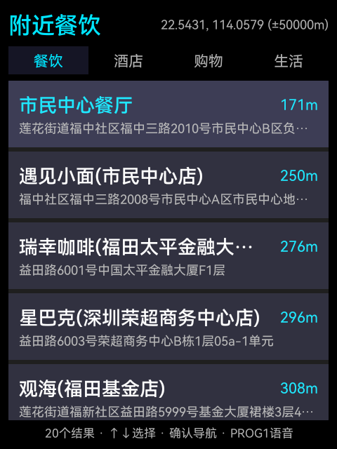
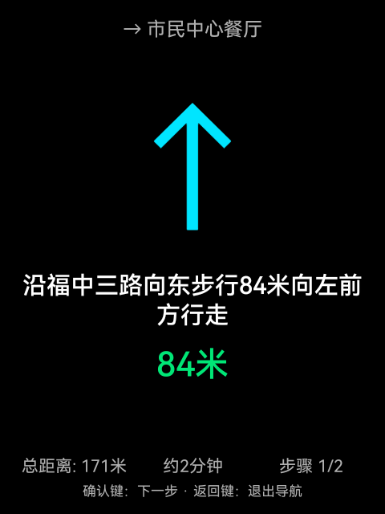
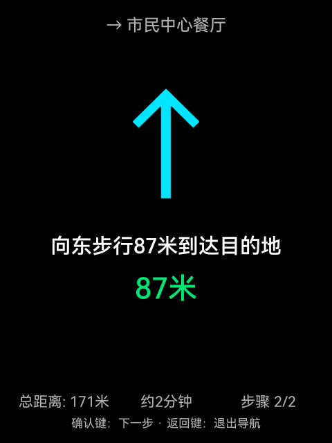
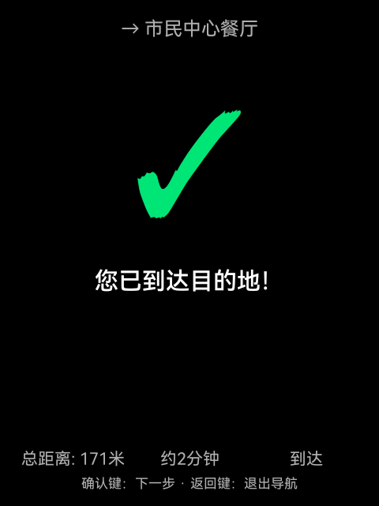

# Rokid AI 眼镜 AR 导航应用

> 为 **Rokid AI 眼镜（RG-glasses）** 开发的原生 Android AR 导航应用，实现附近地点搜索、语音搜索目的地、步行导航 HUD 三大核心功能。

---

## 运行截图

| 附近餐饮 | 步行导航 | 下一步 | 到达目的地 |
|----------|----------|--------|----------|
|  |  |  |  |

---

## 功能特性

### 功能1：附近地点探索
- 餐饮 / 酒店 / 购物 / 生活 四个分类标签
- 按距离排序，显示名称、地址、距离
- 左右键切换分类，上下键滚动列表

### 功能2：语音搜索
- 按 **PROG1 键** 触发系统语音识别
- 支持中文自然语言搜索目的地
- 结果以列表形式展示，可直接导航

### 功能3：步行导航 HUD
- 高德步行路线规划，分步骤显示
- **大号箭头**指示转向方向（↑ ← → ↖ ↗ ✓）
- 中文语音播报（TTS）转向提示
- 到达目的地绿色勾号提示

---

## 硬件适配

| 参数 | Rokid AI 眼镜（RG-glasses） |
|------|---------------------------|
| 系统 | Android 12 (SDK 32) |
| 芯片 | 高通平台 / Adreno 621 GPU |
| 内存 | 1.8GB RAM |
| 屏幕 | 480×640（竖屏） |
| 传感器 | 加速度计 + 陀螺仪（无磁力计/GPS） |
| 输入 | 触控板（上下左右/确认/返回/PROG1-4） |
| 定位 | WiFi/网络定位（fused provider） |

### 按键映射

| 按键 | 功能 |
|------|------|
| ↑ / ↓ | 滚动 POI 列表 |
| ← / → | 切换分类标签 |
| 确认键(ENTER) | 选择 / 开始导航 |
| 返回键(BACK) | 返回上一页 |
| PROG1 / 录制键 | 触发语音搜索 |

---

## 技术方案

- **开发语言**：Java（原生 Android）
- **地图服务**：高德地图 Web API（REST）
  - POI 周边搜索 `/v3/place/around`
  - 关键词搜索 `/v3/place/text`
  - 步行路线规划 `/v3/direction/walking`
  - IP 定位 `/v3/ip`
- **定位降级策略**：系统 fused provider → 高德 IP 定位 → 默认位置
- **语音**：Android 系统 `SpeechRecognizer` + `TextToSpeech`
- **UI 设计**：暗色主题（黑色背景=透明，适合 AR 显示）+ 大字体

---

## 项目结构

```
RokidNavigation/
├── app/
│   ├── src/main/
│   │   ├── java/com/rokidnav/
│   │   │   ├── RokidNavApp.java          # Application 类，高德 API Key 配置
│   │   │   ├── ui/
│   │   │   │   ├── MainActivity.java     # 主界面（附近地点列表 + 标签切换）
│   │   │   │   ├── NavigationActivity.java  # 导航 HUD 界面
│   │   │   │   ├── SearchActivity.java   # 语音搜索界面
│   │   │   │   └── PoiAdapter.java       # POI 列表适配器
│   │   │   ├── service/
│   │   │   │   └── LocationService.java  # 前台定位服务（三级降级策略）
│   │   │   └── util/
│   │   │       ├── AmapApi.java          # 高德 REST API 封装
│   │   │       └── KeyHelper.java        # Rokid 触控板按键映射
│   │   ├── res/
│   │   │   ├── layout/                   # 适配 480×640 竖屏的 UI 布局
│   │   │   └── values/                   # 颜色/字符串/样式
│   │   └── AndroidManifest.xml
│   └── build.gradle
├── build.gradle
├── settings.gradle
└── gradle.properties
```

---

## 编译与安装

### 环境要求

- Android SDK（compileSdkVersion 33，minSdkVersion 29）
- Java 11+
- Gradle 7.5.1

### 编译

```bash
# 在项目根目录执行
./gradlew assembleDebug
```

APK 输出路径：`app/build/outputs/apk/debug/app-debug.apk`

### 安装到 Rokid 眼镜

```bash
# 确保 Rokid 眼镜通过 USB 连接并开启 ADB
adb -s <rokid设备序列号> install -r app/build/outputs/apk/debug/app-debug.apk

# 授予定位权限
adb -s <rokid设备序列号> shell pm grant com.rokidnav android.permission.ACCESS_FINE_LOCATION
adb -s <rokid设备序列号> shell pm grant com.rokidnav android.permission.ACCESS_COARSE_LOCATION

# 启动应用
adb -s <rokid设备序列号> shell am start -n com.rokidnav/.ui.MainActivity
```

---

## 高德 API 配置

在 `RokidNavApp.java` 中替换为你自己的高德 Web API Key：

```java
public static final String AMAP_KEY = "你的高德WebAPIKey";
```

高德开放平台：[https://lbs.amap.com/](https://lbs.amap.com/)

---

## 开发背景

本项目基于对 **雷鸟 X3 Pro**（`com.ffalcon.navigation` 地图 + `com.rayneo.lifeai` 智慧生活）应用的深度分析，
针对 Rokid AI 眼镜的硬件限制（无 GPS、无磁力计、1.8GB 内存）重新设计：

- 放弃 Unity/OpenXR（内存不足），改用原生 Android
- 放弃 3D AR 箭头（无磁力计无法确定绝对方向），改用 2D HUD
- 放弃高德地图 SDK AAR（减小 APK 体积），改用高德 REST API
- 针对 Rokid 触控板按键逐一适配

---

## 免责声明

- 本项目为**个人学习研究**目的开发，与 Rokid 公司无关
- 高德地图 API 使用须遵守[高德开放平台服务条款](https://lbs.amap.com/home/terms)
- 如本项目涉及任何知识产权问题，请联系作者删除

---

## License

[MIT License](LICENSE)
